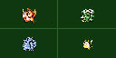
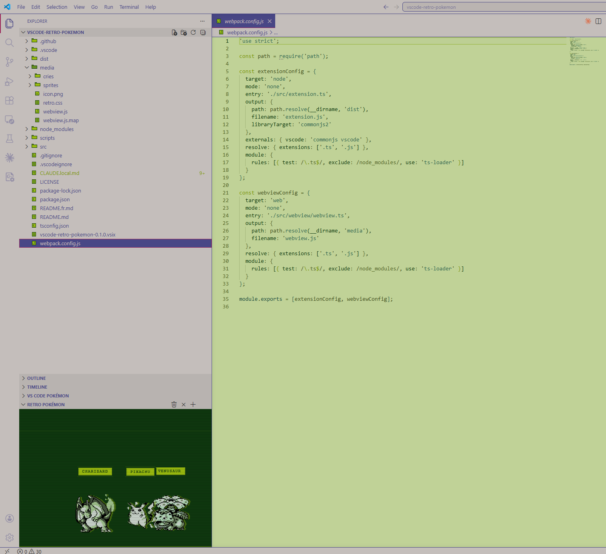
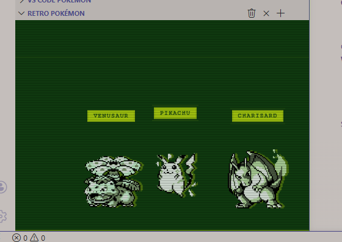

<div align="center">

<br>

# Retro Pokemon

<br>



<br><br><br>

[English](README.md)

<br>

Des compagnons Pokémon Gen 1 style Game Boy animés, directement dans la barre latérale de VS Code.

</div>

<br>

Les sprites se promènent, sautent et s'animent avec une palette de verts Game Boy, des effets de lignes CRT et des glitches VHS. Cliquez sur un Pokémon pour entendre son cri 8-bit original. Invoquez-les et capturez-les avec des animations de Pokéball et des sons synthétisés rétro.

Inspiré de [vscode-pokemon](https://marketplace.visualstudio.com/items?itemName=jakobhoeg.vscode-pokemon) par jakobhoeg, développé de façon indépendante avec les ressources de [PokeAPI](https://pokeapi.co/).





---

## Fonctionnalités

- Les 151 Pokémon de la Gen 1 avec leurs sprites authentiques Rouge/Bleu
- Filtre palette 4 tons Game Boy avec aberration chromatique
- Superposition de lignes CRT et effets de scintillement et de bande VHS
- Animations de lancer et capture de Pokéball avec sons 8-bit synthétisés
- Clic sur un Pokémon pour jouer son cri 8-bit original
- Machine à états par Pokémon : repos, marche, saut
- Panneau latéral dont la taille des sprites s'adapte à la hauteur de la section

---

## Commandes

Toutes les commandes sont accessibles depuis la palette de commandes (`Ctrl+Shift+P`) et depuis les icônes de la section Retro Pokémon dans la barre latérale.

| Commande | Icône | Description |
| --- | --- | --- |
| Retro Pokemon: Spawn Pokemon | `+` | Choisir un Pokémon Gen 1 dans la liste |
| Retro Pokemon: Spawn Random | shuffle | Invoquer un Pokémon aléatoire |
| Retro Pokemon: Remove Pokemon | `x` | Choisir un Pokémon de l'équipe à capturer |
| Retro Pokemon: Remove All | corbeille | Capturer tous les Pokémon d'un coup |

---

## Configuration

| Paramètre | Type | Défaut | Description |
| --- | --- | --- | --- |
| `retro-pokemon.size` | nombre | `3` | Nombre maximum de Pokémon affichés simultanément (1-6) |
| `retro-pokemon.gbPalette` | booléen | `true` | Appliquer le filtre palette verte Game Boy original |
| `retro-pokemon.scanlines` | booléen | `true` | Afficher la superposition de lignes CRT |

---

## Installation

### Depuis le Marketplace

Recherchez **Retro Pokemon** dans le panneau Extensions de VS Code (`Ctrl+Shift+X`).

### Depuis un fichier VSIX

1. Téléchargez le dernier `.vsix` depuis la page [Releases](https://github.com/seven-monarchs/vscode-retro-pokemon/releases)
2. Dans VS Code : panneau Extensions > menu `...` > **Installer depuis VSIX**

---

## Développement

### Prérequis

```bash
npm install
```

Les sprites et les cris sont inclus dans `media/`. Pour les re-télécharger depuis PokeAPI :

```bash
node scripts/download-sprites.js
node scripts/download-cries.js
```

### Compilation

```bash
npm run compile        # build de développement
npm run watch          # mode watch
```

### Lancer en mode développement

Appuyez sur `F5` dans VS Code pour ouvrir une instance de développement avec l'extension chargée.

### Empaquetage

```bash
npx vsce package --no-dependencies
```

---

## Crédits

- Sprites : [PokeAPI sprites](https://github.com/PokeAPI/sprites) - PNG transparents Gen 1 Rouge/Bleu
- Cris : [PokeAPI cries](https://github.com/PokeAPI/cries) - fichiers OGG 8-bit legacy
- Pokémon et tous les noms associés sont des marques déposées de Nintendo / Game Freak. Ce projet est un travail de fan sans affiliation commerciale.
